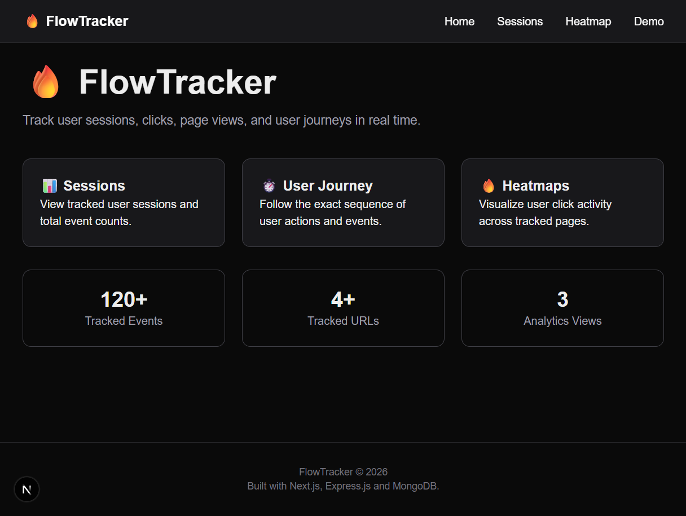
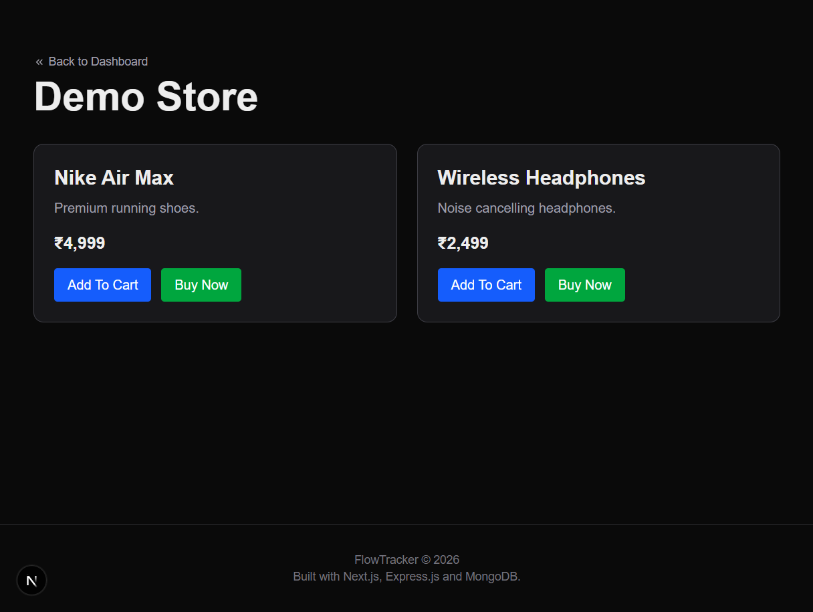
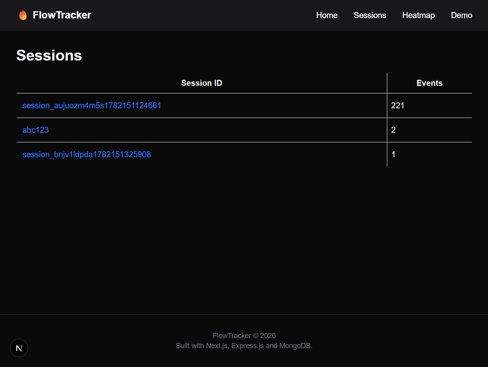
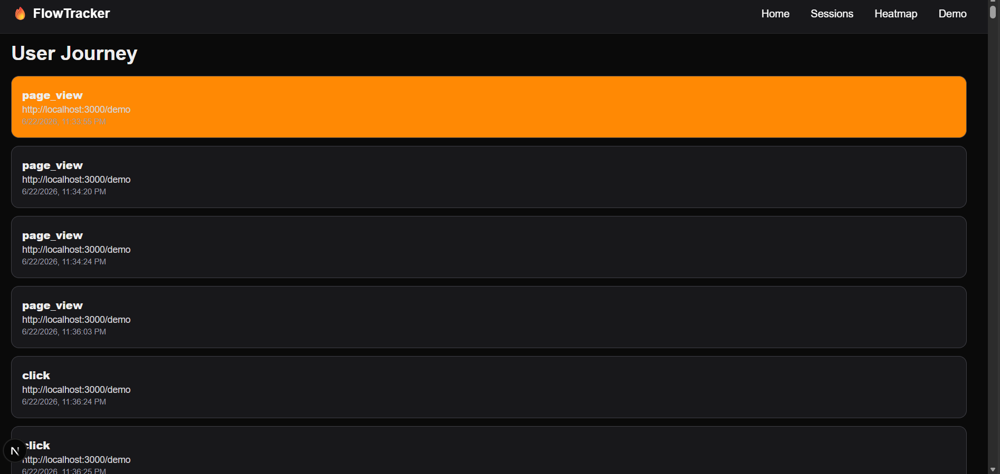
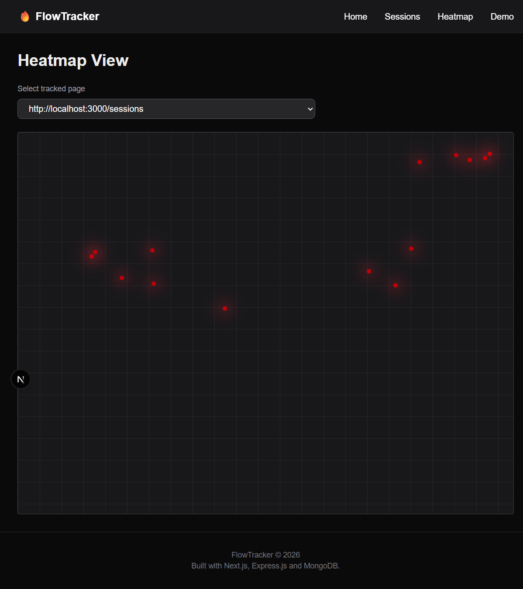

# FlowTracker

A full-stack user analytics dashboard that tracks user interactions on a webpage, stores analytics data in MongoDB Atlas, and visualizes user behavior through session analytics, user journeys, and click heatmaps.

---

## Live Demo

| Service | URL |
|---|---|
| Frontend (Vercel) | https://flow-tracker-nine.vercel.app |
| Backend API (Render) | https://flowtracker-backend.onrender.com |

FlowTracker is deployed as a full-stack application using Vercel for the frontend, Render for the backend API, and MongoDB Atlas for cloud database storage.

---

## Overview

FlowTracker provides a lightweight analytics solution that captures user activity and presents actionable insights through an interactive dashboard.

The application consists of:
- A JavaScript tracking script that records user events
- A Node.js + Express backend for data collection and querying
- MongoDB Atlas for cloud event storage
- A Next.js dashboard for analytics visualization

The project is fully deployed with a Vercel frontend, Render backend, and MongoDB Atlas database.

---

## Features

### Event Tracking

The tracking script can be embedded into any webpage and records:
- Page Views (`page_view`)
- Click Events (`click`)

Each event includes:

| Field | Description |
|---|---|
| `session_id` | Unique session identifier |
| `event_type` | Type of event (`page_view` or `click`) |
| `url` | Page URL where the event occurred |
| `timestamp` | ISO timestamp of the event |
| `x`, `y` | Click coordinates (for click events) |

Session IDs are persisted using `localStorage` to maintain continuity across page visits.

### Sessions Dashboard
- Lists all tracked sessions
- Shows total event count per session
- Click any session to inspect its complete activity history

### User Journey View

Visualizes the chronological sequence of events for a selected session. Each event displays:
- Event type
- Page URL
- Timestamp

Allows reconstruction of the exact path a user followed while interacting with the website.

### Heatmap Visualization

Displays click activity for tracked pages:
- URL selection dropdown to switch between pages
- Coordinate-based click rendering
- Simple heatmap representation of user interaction patterns

### Demo Page

A sample tracked webpage included to demonstrate:
- Page view tracking
- Click tracking
- Session generation
- Heatmap data collection

The demo page allows quick end-to-end testing of the complete analytics pipeline.

---

## Tech Stack

| Layer | Technology |
|---|---|
| Frontend | Next.js, React, Tailwind CSS |
| Backend | Node.js, Express.js |
| Database | MongoDB Atlas, Mongoose |
| Tracking | Vanilla JavaScript |

---

## Screenshots

### Home Dashboard


### Demo Page


### Sessions View


### User Journey View


### Heatmap View


---

## Deployment

FlowTracker is deployed across three services:
- **Frontend:** Next.js dashboard hosted on Vercel
- **Backend:** Node.js + Express API hosted on Render
- **Database:** MongoDB Atlas for persistent event storage

The frontend communicates with the backend through a public API URL configured using environment variables, and the backend connects to MongoDB Atlas for storing and querying analytics events.

---

## Project Structure

```
flowtracker/
│
├── README-assets/
│
├── backend/
│   ├── server.js
│   ├── routes/
│   ├── controllers/
│   ├── models/
│   └── config/
│
├── app/
│
├── components/
│   ├── SessionTable.jsx
│   ├── SessionJourney.jsx
│   ├── Heatmap.jsx
│   └── ...
│
├── public/
│   └── tracker.js
│
├── services/
│   └── api.js
│
├── README.md
├── jsconfig.json
├── eslint.config.mjs
├── package.json
└── .gitignore
```

---

## API Endpoints

### `POST /api/events`
Stores a user interaction event.

```json
{
  "session_id": "session_xyz123",
  "event_type": "click",
  "url": "https://flow-tracker-nine.vercel.app/demo",
  "timestamp": "2026-06-22T12:00:00Z",
  "x": 42,
  "y": 68
}
```

---

### `GET /api/events/sessions`
Returns all tracked sessions with their event counts.

---

### `GET /api/events/session/:sessionId`
Returns the complete ordered event history for a given session.

---

### `GET /api/events/heatmap?url=<page_url>`
Returns click coordinates for the specified page URL.

---

### `GET /api/events/urls`
Returns all tracked URLs available for heatmap visualization.

---

## Database Schema

```js
{
  session_id: String,
  event_type: String,   // "page_view" | "click"
  url:        String,
  timestamp:  Date,
  x:          Number,
  y:          Number
}
```

---

## Setup Instructions

**1. Clone the repository**
```bash
git clone https://github.com/qwerty12-ai/FlowTracker.git
cd FlowTracker
```

**2. Install frontend dependencies**
```bash
npm install
```

**3. Install backend dependencies**
```bash
cd backend
npm install
```

**4. Configure environment variables**

Backend — create `backend/.env`:
```env
MONGO_URI=your_mongodb_atlas_connection_string
PORT=5000
FRONTEND_URL=http://localhost:3000
```

Frontend — create `.env.local` in the project root:
```env
NEXT_PUBLIC_API_URL=http://localhost:5000/api/events
```

**5. Start the backend**
```bash
cd backend
npm run dev
```
Backend runs on `http://localhost:5000`

**6. Start the frontend**
```bash
npm run dev
```
Frontend runs on `http://localhost:3000`

---

## Production Deployment Notes

For production deployment, FlowTracker uses:
- **Vercel** for the frontend
- **Render** for the backend API
- **MongoDB Atlas** for the database

**Frontend environment variables (Vercel)**
```env
NEXT_PUBLIC_API_URL=https://flowtracker-backend.onrender.com/api/events
```

**Backend environment variables (Render)**
```env
MONGO_URI=your_mongodb_atlas_connection_string
FRONTEND_URL=https://flow-tracker-nine.vercel.app
PORT=10000
```

The tracking script and frontend API layer were updated to remove hardcoded localhost URLs and support both local development and deployed production usage.

---

## Features Coverage

### Event Tracking
- [x] Track `page_view` events
- [x] Track `click` events
- [x] Persist session IDs via `localStorage`
- [x] Capture page URLs
- [x] Capture timestamps
- [x] Capture click coordinates
- [x] Send events to backend API

### Backend
- [x] Receive and store events
- [x] Fetch session list
- [x] Fetch session events
- [x] Fetch heatmap data
- [x] Fetch tracked URLs

### Database
- [x] MongoDB integration
- [x] Structured event schema

### Dashboard
- [x] Sessions View
- [x] User Journey View
- [x] Heatmap View
- [x] URL selection for heatmaps

---

## Assumptions & Trade-offs

- Session persistence is handled using `localStorage` for simplicity.
- Heatmap rendering uses coordinate plotting rather than an external visualization library.
- Authentication was intentionally omitted to keep the project focused on analytics functionality.
- The application is designed for demonstration purposes.
- The tracker script supports both local development and deployed production environments through environment-based API configuration.

---

## Future Improvements

- Real-time event streaming
- Advanced heatmap rendering with density gradients
- Session duration analytics
- Funnel analysis
- User segmentation
- Dashboard filtering and search
- Export analytics reports

---

## Author

**Mohd Abdul Sabeeh**